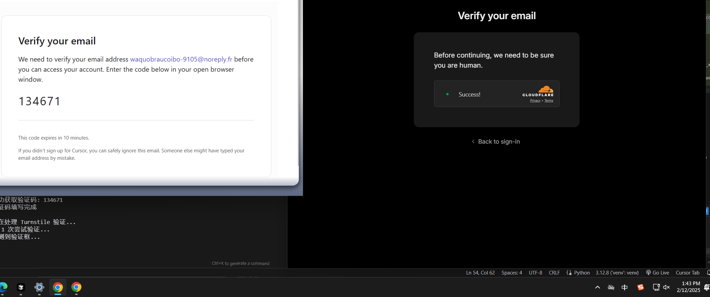
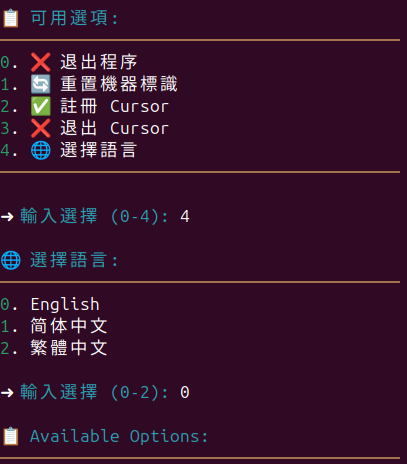
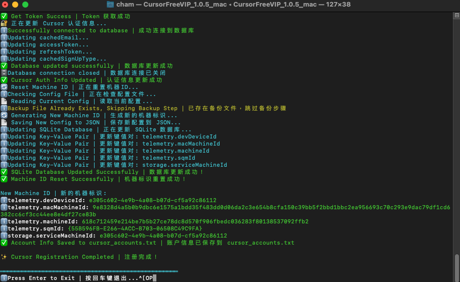
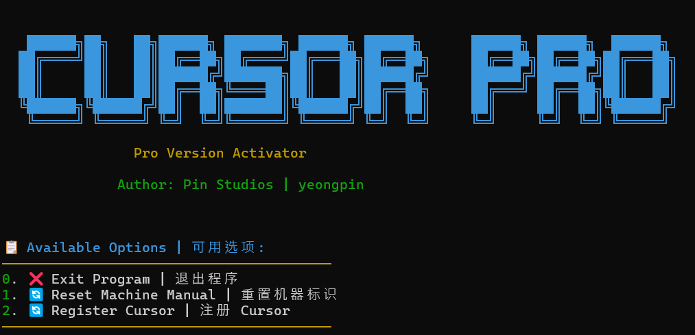
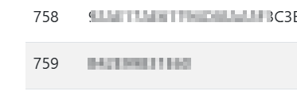
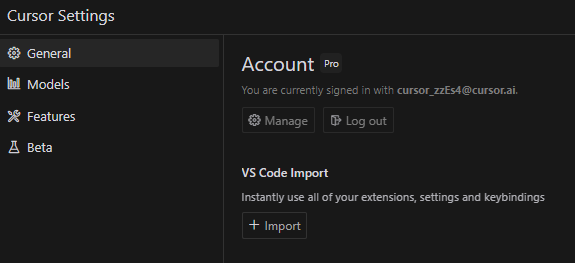
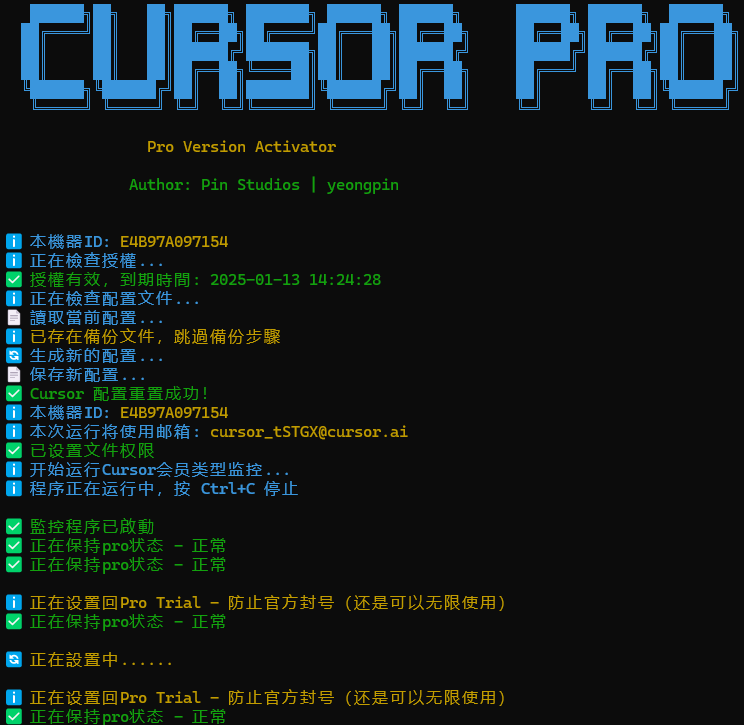

# Change Log

## v1.11.02
1. Fill: Missing Translations（ar, zh-cn, zh-tw, vi, nl, de, fr, pt, ru, tr, bg, es, ja, it） | 填補缺失的翻譯
2. Add: Japanese and Italian language support
3. Refactor: Account Generation with Faker and Update requirements.txt
4. Add: script to auto-translate missing keys in translation files | 增加 fill_missing_translations.py 自動翻譯缺失的翻譯鍵
5. Add: TempMailPlus Support, support temp email verification | 新增 TempMailPlus 配置，支持临时邮箱验证功能
6. Fix: Chrome user data directory permission problem on mac | 修復 Chrome 用戶數據目錄權限問題 on mac
7. Fix: Some Issues | 修復一些問題

## v1.11.01
0. Must Update to this version to get full experience | 必須更新到此版本以獲取完整體驗
1. Restore: Some Main Code | 恢復一些主程式碼
2. Add: Arabic language | 增加阿拉伯語
3. Add: Language configuration saved setting | 增加語言配置保存設定
4. Add: Restore Machine ID from Backup | 增加從備份恢復機器ID
5. Add: Owned Website Check Version | 增加擁有網站檢查版本
6. Fix: use cursor_path from config_file | 修復使用 cursor_path 從 config_file
7. Fix: macOS 'bypass_version.py' get product_json_path from config_file | 修復 macOS 'bypass_version.py' 從 config_file 獲取 product_json_path
8. Fix: Some Issues | 修復一些問題

## v1.10.05
1. Remove block_domain.txt | 移除 block_domain.txt
2. Original Code In Github , If u afraid of virus, please clone the code and run locally | 原始碼在 Github 上，如果怕病毒，請複製原始碼並在本機運行
3. All Action using github workflow , not build myself , so i cant place virus in the file | 所有 Action 使用 github workflow ，不是我自己 build 的，所以我不會在文件中放置病毒
4. Fix: Some Issues | 修復一些問題

## v1.10.04
1. Hotfix: Reset Process Error: cannot access local variable 'main_path' where it is not associated with a value on windows & macos | 修復在 Windows 和 macOS 上無法訪問局部變量 'main_path' 的問題
2. Fix: Some Issues | 修復一些問題

## v1.10.03
1. Add: Manual Registration | 增加手動註冊
2. Only support your own Email | 只支持自己的Email 請勿使用Temp Email 註冊 註冊假賬號.
3. Fix: macOS 'bypass_version.py' get product_json_path from config_file | 修復 macOS 'bypass_version.py' 從 config_file 獲取 product_json_path
4. Fix: use cursor_path from config_file | 修復使用 cursor_path 從 config_file
5. Fix: Some Issues | 修復一些問題

## v1.10.02
1. Remove: Remove All Auto generating fake Google email accounts and OAuth access | 移除所有自動生成假 Google 電子郵件帳戶和 OAuth 訪問
2. Follow GitHub Terms of Service | 遵守 GitHub Terms of Service
3. Follow Cursor Terms of Service | 遵守 Cursor Terms of Service
4. All are for educational purposes, currently the repo does not violate any laws | 全都是教育用途，目前 repo 沒有違反任何法律
5. This project adopts CC BY-NC-ND 4.0 , do not use for commercial purposes | 本專案採用 CC BY-NC-ND 4.0，拒絕任何商業用途
6. Use & Cherish | 切用且珍惜
7. Same as v1.10.01 | 與 v1.10.01 相同 
8. Fix: reset machine ID no module name 'new_signup' | 修復機器 ID 重置 no module name 'new_signup'
9. Fix: Some Issues | 修復一些問題

## v1.10.01
1. Remove: Remove All Auto generating fake Google email accounts and OAuth access | 移除所有自動生成假 Google 電子郵件帳戶和 OAuth 訪問
2. Follow GitHub Terms of Service | 遵守 GitHub Terms of Service
3. Follow Cursor Terms of Service | 遵守 Cursor Terms of Service
4. All are for educational purposes, currently the repo does not violate any laws | 全都是教育用途，目前 repo 沒有違反任何法律
5. This project adopts CC BY-NC-ND 4.0 , do not use for commercial purposes | 本專案採用 CC BY-NC-ND 4.0，拒絕任何商業用途
6. Use & Cherish | 切用且珍惜
7. Fix: Some Issues | 修復一些問題

## v1.9.05
1. Refactor: Using match-case to refactor language mapping and menu selection logic, making the code clearer and more maintainable. | 使用 match-case 重构语言映射和菜单选择逻辑，使代码更清晰、可维护性更高。
2. Ci: Update the Python version in the ARM64 Docker build container to 3.10, making it more compatible and easier to migrate in the future. | 更新 ARM64 Docker 构建容器中的 Python 版本至 3.10，兼容性更强，方便未来迁移。
3. Fix: f-string backslash expression errors in multiple files | 修復多個文件中的 f-string 反斜杠表達式錯誤
4. Sync AUR new version 1.9.04 | 同步 AUR 新版本 1.9.04
5. Fix: missing license install on pkgbuild @michaeldavis246611119 mention here | 修復 pkgbuild 中缺少授權安裝 @michaeldavis246611119 提到這裡
6. Fix: readme table | 修復 readme 表格
7. Fix: google-chrome package name problem, add "google-chrome-stable" [Bug]: Chrome error | Arch | gnome | AUR chrome #242 [Discussion]: how to use the new feature, Register with Google Account #249 [Discussion]: Having issues using the script in Ubuntu #487 [Bug]: Can open chromium bin in linux #616 | 修復 google-chrome 包名稱問題，添加 "google-chrome-stable" [Bug]: Chrome error | Arch | gnome | AUR chrome #242 [Discussion]: how to use the new feature, Register with Google Account #249 [Discussion]: Having issues using the script in Ubuntu #487 [Bug]: Can open chromium bin in linux #616
8. Fix: exception error log | 修復異常錯誤日誌
9. Fix: github oauth error [Bug]: #564 | 修復 github oauth 錯誤 [Bug]: #564
10. Fix: ChromiumOptions.arguments type error: list object has no attribute 'get' | 修復 ChromiumOptions.arguments 類型錯誤：list 對象沒有屬性 'get'
11. Fix: Some Issues | 修復一些問題

## v1.9.04
1. Add: Opera GX Support | 添加 Opera GX 支持
2. Same as v1.9.03 | 與 v1.9.03 相同
3. Hotfix: Some Issues | 修復一些問題
4. Add: Bypass Cursor JWT EXP Problem | 添加繞過 Cursor JWT EXP 問題
5. Fix: Cursor editor redirects to logout page and logout automatically | 修復 Cursor 編輯器重定向到登出頁面並自動登出
6. Fix: Some Issues | 修復一些問題

## v1.9.03[Skip & Merge to v1.9.04]
1. Hotfix: Some Issues | 修復一些問題
2. Add: Bypass Cursor JWT EXP Problem | 添加繞過 Cursor JWT EXP 問題
3. Fix: Cursor editor redirects to logout page and logout automatically | 修復 Cursor 編輯器重定向到登出頁面並自動登出
4. Fix: Some Issues | 修復一些問題

## v1.9.02
1. Add: Bypass Token Limit | 添加繞過 Token 限制
2. Add: More Browser Support | 添加更多瀏覽器支持
3. Add: Bypass Cursor JWT EXP Problem | 添加繞過 Cursor JWT EXP 問題
4. Support: Add Opera, Brave, Edge, Firefox | 添加支持 Opera, Brave, Edge, Firefox
5. Add config manual browser path | 添加配置手動選擇遊覽器路徑
5. Fix: Browser Profile Selection | 修復瀏覽器配置文件選擇
6. Fix: Cursor editor redirects to logout page and logout automatically | 修復 Cursor 編輯器重定向到登出頁面並自動登出
7. Fix: Config File Path | 修復配置文件路徑
8. Fix: window user permission | 修復 window 用戶權限
9. Fix: Some Issues | 修復一些問題

## v1.9.01
1. Add: Bypass Token Limit | 添加繞過 Token 限制
2. Add: More Browser Support | 添加更多瀏覽器支持
3. Support: Add Opera, Brave, Edge, Firefox | 添加支持 Opera, Brave, Edge, Firefox
4. Add config manual browser path | 添加配置手動選擇遊覽器路徑
5. Fix: Browser Profile Selection | 修復瀏覽器配置文件選擇
6. Fix: Some Issues | 修復一些問題

## v1.8.10
1. Add: Check User Authorized | 添加檢查用戶授權
2. Fix: Linux Reset Process Error: 'base' | 修復 Linux 重置過程錯誤：'base'
3. Updated the get_workbench_cursor_path function to handle Linux systems more effectively. | 更新 get_workbench_cursor_path 函數以更有效地處理 Linux 系統
4. Added logic to use the first base path if no valid paths are found in the existing loop. | 添加邏輯以在找不到有效路徑時使用第一個基礎路徑
5. Improved maintainability and clarity of the code by explicitly handling different operating systems. | 通過明確處理不同的操作系統，顯著提高了代碼的可維護性和清晰性
6. Fix: Some Issues | 修復一些問題

## v1.8.09
1. Add: Bypass Token Limit Check | 繞過 Token 使用限制檢查
2. Add：Bypass Claude Limit 30000 set to 900000(9e5) | 繞過 Claude 使用限制 30000 設置為 900000(9e5)
3. Add: Force Update Config | 添加強制更新配置
4. Add: Multilanguage support for force update | 添加強制更新功能的多語言支持
5. Fix: Reset break | 修復重置中斷
4. Fix: Some Issues | 修復一些問題

## v1.8.08
1. Add: Force Update Config | 添加強制更新配置
2. Add: Multilanguage support for force update | 添加強制更新功能的多語言支持
3. Fix: Google Auth & Github Auth JWT Problem | 修復 Google Auth & Github Auth JWT 問題
4. Fix: Totally reset import & import * raw options problem | 修復 totally reset import & import * raw 選項問題
5. Fix: reset.file_not_found problem | 修復 reset.file_not_found 問題
6. Outdated: Bypass Cursor Version Check | 過期：繞過 Cursor 版本檢查
7. Document: i.header.set("x-cursor-config-version", "UUID4-xxxxxx-xxxxxx-xxxxxx-xxxxxx"); | 文檔：i.header.set("x-cursor-config-version", "UUID4-xxxxxx-xxxxxx-xxxxxx-xxxxxx");
8. Fix: Some Issues | 修復一些問題

## v1.8.07
1. Add: Bypass Cursor Version Check | 添加繞過 Cursor 版本檢查
2. Add: Multilanguage support for bypass | 添加繞過的多語言支持
3. MSG: Free & free trial accounts can no longer use chat with premium models on Cursor Version 0.45 or less. Please upgrade to Pro or use Cursor Version 0.46 or later. Install Cursor at https://www.cursor.com/downloads or update from within the editor.
4. Fix: Some Issues | 修復一些問題

## v1.8.06
1. Add: Google Account Deletion Feature | 添加 Google 账号删除功能
2. Update: Menu with new account deletion option | 更新菜单添加账号删除选项
3. Add: Multilanguage support for account deletion | 添加账号删除功能的多语言支持
4. Fix: Improve usage limits check and tuple index error | 修复使用限制检查和元组索引错误
5. Fix: bug in disable cursor auto update | 修复禁用 Cursor 自动更新的错误
6. Fix: Linux-appimage | 修复 Linux-appimage 问题
7. Add: Support for custom Cursor installation paths on Windows | 添加 Windows 系统下自定义 Cursor 安装路径支持
8. Add: Chrome profile selection feature | 添加 Chrome 配置文件选择功能
9. Fix: improve account usage limit detection | 修復賬號檢測
10. Fix: For custom Chrome Installations | 修復自定義chrome遊覽器安裝

## v1.8.05
1. Fix: Linux Path Not Found ｜ 修復linuxpath問題
2. Add: support for detecting both 150/150 and 50/50 usage limits ｜ 添加偵測50 或者150的使用量
3. Improve: usage parsing and validation ｜ 檢測使用量

## v1.8.04
1. Update totally_reset_cursor.py | 更新 totally_reset_cursor.py
2. Fix: improve Linux Chrome visibility and root user handling | 修復 Linux Chrome 可見性以及 root 用戶處理
3. Fix: improve Linux path handling and fix permission issues | 修復 Linux 路徑處理以及修復權限問題
4. Fix: Some Issues | 修復一些問題

## v1.8.03
1. Fix: Improve Linux path handling and add case-insensitive Cursor directory detection ｜ 修復Linux系統路徑錯誤以及添加cursor 路徑偵測
2. Fix: Some Issues | 修復一些問題

## v1.8.02
1. Add: New Temp Email | 增加新臨時郵箱
2. Add: Config Options | 增加配置選項
3. Add: Update Windows Machine ID | 增加更新 Windows 機器 ID
4. Add: Contributors Options | 增加貢獻者選項
5. Add: Check update enable Options In config | 增加在 config 中檢查更新選項
6. Add: Show account info enabled options in config | 增加在 config 中顯示賬號信息選項
7. Optimize Row & Colume Options | 優化行與列選項
8. Fix: Too Many Free Trial On Some Machine | 修復某些機器上太多免費試用
9. Fix: Disable Auto Update | 修復禁用自動更新
10. Fix: Linux Chrome Not Open Correct | 修復 Linux Chrome 未正確打開
11. Fix: Some Issues | 修復一些問題

## v1.8.01
1. Add: Cursor Account Info | 增加 Cursor 賬號信息
2. Fix: Disable Auto Update | 修復禁用自動更新
3. Add: 0.48.x Version Support | 增加 0.48.x 版本支持
4. Revert: Totally Reser Cursor to Beta | 恢復完全重置 Cursor 到 Beta
5. Reopen: Totally Reset Cursor | 重新開啟完全重置 Cursor
6. Fix: Logo.py Center | 修復 Logo.py 居中
7. Fix: Linux Chrome Not Open Correct | 修復 Linux Chrome 未正確打開
8. Fix: Some Issues | 修復一些問題

## v1.7.18
1. Fix: No Write Permission | 修復沒有寫入權限
2. Fix: Improve Linux path detection and config handling ｜ 修正 linux 路徑和config寫入讀取
3. Fix: Locale path_no_exist missing ｜ 修正 path_no_exist 語言遺失
4. Fix: Some Issues | 修復一些問題

## v1.7.17
1. Fix: Remove 10 options Totally Reset Cursor | 修復完全重置 Cursor 選項

## v1.7.16
1. Add bulgarian language | 增加保加利亚语
2. Fix: Some Issues | 修復一些問題
3. Add: Contributors | 增加貢獻者
4. Fix: Total Reset Cursor | 修復完全重置 Cursor
5. Add: Display Features and Warnings | 增加顯示功能與警告
6. Fix: Totally Reset Cursor | 修復完全重置 Cursor
7. Remake: Logo.py Center | 重做 Logo.py 居中

## v1.7.15
1. Fix: Cant Verify the User is Human | 修復無法驗證用戶是否為人類
2. Added temporary email & GitHub + Cursor AI registration automation | 增加临时邮箱 & GitHub + Cursor AI 注册自动化
3. Added Turkish language support | 增加土耳其语支持
4. Removed outdated temporary option in Option 2 | 移除选项2中的过期临时添加项
5. Enhanced machine ID reset (Linux, Windows, macOS), bypasses Cursor free trial detection | 机器 ID 重置支持 Linux/Windows/macOS，绕过 Cursor 免费试用检测
6. Expanded Cursor AI file detection, deep removal of leftover trial files | 扩展 Cursor AI 文件检测，深度清理残留试用文件
7. Optimized logging, replaced print with logging module, added verification steps | 日志优化，统一采用 logging 模块，增加验证步骤提示
8. Added retry mechanism for email verification | 增加邮箱验证重试机制
9. Automated GitHub OAuth login for Cursor AI | 自动 GitHub OAuth 登录 Cursor AI
10. Saved registered GitHub accounts and timestamps | 保存 GitHub 账户和注册时间戳
11. Added user confirmation before execution | 添加用户确认步骤，防止误操作
12. Displayed feature list & warnings before actions | 显示功能与风险警告
13. Improved Selenium flow and error handling | 增强 Selenium 流程与错误处理
14. Added Chrome process tracking and cleanup | 增加 Chrome 进程跟踪和清理

## v1.7.14
1. Added a Russian locale to program, fixed a typo in readme.md. Also translated other files ｜  
   為程式新增了俄語語系，修正了 readme.md 的拼寫錯誤，並翻譯了其他文件。  

2. Changing the directory from ~/.config/Cursor to ~/.config/cursor ｜  
   將目錄從 `~/.config/Cursor` 更改為 `~/.config/cursor`。  

3. Changing the filename from machineId to machineid ｜  
   將檔案名稱從 `machineId` 更改為 `machineid`。  

4. Updated all related paths in: ｜  
   更新了以下檔案中的相關路徑：  
   - `reset_machine_manual.py`  
   - `config.py`  

5. Added Linux path note in README.md ｜  
   在 `README.md` 中新增了 Linux 路徑的說明。  

6. These changes align with Linux filesystem conventions and fix issues with Chrome/Chromium integration ｜  
   這些變更符合 Linux 文件系統的規範，並修復了與 Chrome/Chromium 整合的問題。  

7. This PR adds retry logic to handle the 'Can't verify the user is human' error during registration ｜  
   此 PR 新增了重試機制，以處理註冊時的「無法驗證用戶是否為人類」錯誤。  

8. Added max 5 retries for form submission when human verification fails ｜  
   當人類驗證失敗時，最多允許 5 次表單提交重試。  

9. Added random delays between retries (2-4 seconds) ｜  
   在重試之間隨機延遲 2-4 秒。  

10. Enhanced browser fingerprint randomization to better bypass detection ｜  
    增強了瀏覽器指紋的隨機性，以更好地繞過檢測。  

11. Added new translation strings for retry status messages ｜  
    新增了重試狀態訊息的翻譯字串。  

12. Improved error handling and user feedback ｜  
    改進了錯誤處理和用戶回饋機制。  

13. The changes ensure a more robust registration process by automatically retrying when human verification fails, while maintaining human-like behavior through randomized delays and improved browser fingerprinting ｜  
    這些變更確保了更穩定的註冊流程，透過自動重試機制處理人類驗證失敗的情況，同時透過隨機延遲與增強的瀏覽器指紋技術，維持類似人類的行為模式。

## v1.7.13
1. Added _delete_current_account method to handle account deletion via API ｜ 新增 _delete_current_account 方法，透過 API 處理帳號刪除  

2. Updated account reset logic to use the appropriate auth method based on auth_type ｜ 更新帳號重置邏輯，根據 auth_type 選擇適當的驗證方式  

3. Maintained existing Google OAuth reset functionality ｜ 維持現有的 Google OAuth 重置功能  

4. Added proper error handling for account deletion failures ｜ 新增帳號刪除失敗時的錯誤處理  

5. Ensures GitHub authentication maintains its flow when resetting accounts ｜ 確保 GitHub 認證在帳號重置時保持正常流程    

6. The _delete_current_account method makes a POST request to https://www.cursor.com/api/dashboard/delete-account ｜  
   _delete_current_account 方法會發送 POST 請求至 https://www.cursor.com/api/dashboard/delete-account  

7. After successful deletion, redirects back to the authentication page ｜ 刪除成功後，會導回驗證頁面  

8. Uses Promise-based JavaScript for reliable API communication ｜ 使用 Promise-based JavaScript，確保 API 通訊穩定  

9. Includes proper error handling and logging ｜ 包含適當的錯誤處理與日誌記錄

10. Add Brazilian Portuguese language ｜ 新增巴西葡萄牙語

## v1.7.12
1. Add: Changelog Show in Menu | 增加更新日志在菜單中
2. Remake Create Mail Logic | 重做創建郵箱邏輯
3. Fix: Some Issues | 修復一些問題

## v1.7.11 ( Skip & Merge to v1.7.12 )
1. Add: Multi-language Support | 增加多語言支持
2. Add: German Language | 增加德語
3. Add: Dutch Language | 增加荷蘭語
4. Add: French Language | 增加法語
5. Add: Auto Detect Max Use Count | 增加自動檢測最大使用次數
6. Add: Detect & Auto Delete Account | 增加檢測 & 自動刪除賬號
7. Add: Optimize Some Logic | 優化一些邏輯
8. Add: Local Blocked Domains | 增加本地被屏蔽域名
9. Fix : Get Verification Code for None | 修復獲取驗證碼為 None

## v1.7.10
1. Add: Totally Reset Cursor | 增加完全重置 Cursor
2. Add: Multi-language Support for Totally Reset | 增加完全重置多語言支持

## v1.7.09
1. Add: Development Version Check | 增加開發版本檢查
2. Remove: Github Trial Reset | 移除 Github 試用重置
3. Fixed: Some Issues | 修復一些問題

## v1.7.08
1. Add: Google OAuth Authentication | 增加 Google OAuth 認證
2. Add: GitHub OAuth Authentication | 增加 GitHub OAuth 認證
3. Add: Lifetime Access for OAuth Users | 增加 OAuth 用戶終身訪問權限
4. Add: OAuth Authentication Integration | 增加 OAuth 認證集成
5. Update: Menu System with OAuth Options | 更新菜單系統，添加 OAuth 選項
6. Add: Multi-language Support for OAuth | 增加 OAuth 多語言支持

## v1.7.07
1. Add: Vietnamese Language | 增加越南語言
2. Add: Admin Privilege Management for Windows Executable | 增加 Windows 可執行文件管理員權限
3. Implement admin privilege detection for Windows platform | 實現 Windows 平台管理員權限檢測
4. Add functions to check and request admin rights when running as a frozen executable | 增加檢查和請求管理員權限的功能
5. Enhance startup process with admin privilege verification | 增強啟動過程中的管理員權限驗證
6. Add new admin-related emoji to the EMOJI dictionary | 增加新的管理員相關表情符號到 EMOJI 字典
7. Provide fallback mechanism for non-Windows platforms (macos and linux ) | 提供非 Windows 平台（macos 和 linux）的回退機制
These changes make the application more user-friendly by only requesting admin privileges when necessary (when running as an executable). | 這些改進使應用程序更易於使用，只在必要時（當作為可執行文件運行時）請求管理員權限。

## v1.7.06
1. Add: Update Confirm | 增加更新確認
2. Add: Update Skipped | 增加更新跳過
3. Add: Invalid Choice | 增加無效選擇
4. Fix: Cursor Path | 修復 Cursor 路徑
5. Fix: Path Encoding | 修復路徑編碼
6. Fix: Getting Verification Code | 修復獲取驗證碼
7. Fix: Setting Password | 修復設置密碼
8. Fix: Disable Auto Update | 修復禁用自動更新
9. Add Config.py | 增加 Config.py
10. Add utils.py | 增加 utils.py
11. Rebuild some logic | 重新構建一些邏輯

## v1.7.05
1. Fix: Cursor Version Check | 修復 Cursor 版本檢查
2. Fix: Small Problem | 修復一些小問題

## v1.7.04
1. Hotfix: Small Problem | 修復一些小問題

## v1.7.03
1. Hotfix: Small Problem | 修復一些小問題

## v1.7.02
1. Fix: Cursor Path | 修復 Cursor 路徑
2. Add: Config File | 增加配置文件
3. Remove: Workbench Cursor Path | 移除 Workbench Cursor 路徑
4. Remove: Cursor Main JS | 移除 Cursor main.js

## v1.7.01
- Refactoring: Extract configuration-related code from the `setup_driver` function to an independent `setup_config` function
- Optimization: Improve code maintainability and make configuration management and browser settings more clear
- Improvement: The creation and update logic of the configuration file is clearer and more independent

## v1.6.03
1. Hotfix: Small Problem | 修復一些問題

## v1.6.02
1. Hotfix: Small Problem | 修復一些問題
2. Add: Test some Bypass Code | 測試一些繞過代碼

## v1.6.01
1. Fix: Cursor Auth | 修復 Cursor Auth
2. Add: Create Account Maximum Retry | 增加創建賬號最大重試次數
3. Fix: Cursor Auth Error | 修復 Cursor Auth 錯誤
4. Fix: Update Curl Failed | 修復更新 Curl 失敗

## v1.5.03
1. HOTFIX: Stuck on starting browser | 修復啟動瀏覽器卡住問題
2. Small Fix: Error Handling | 小修錯誤處理
3. Small Fix: Translation | 小修翻譯
4. Small Fix: Performance | 小修性能

## v1.5.02
1. Add: Generate Random Name Alias | 增加生成隨機真實姓名
2. Add: Realistic Name Input | 增加真實姓名輸入
3. Optimize: Error Handling | 優化錯誤處理
4. Optimize: Translation | 優化翻譯
5. Optimize: Performance | 優化性能

## v1.5.01
1. Add: Check Latest Version | 增加檢查最新版本
2. Add: Update Command | 增加更新命令

## v1.4.08
1. Add: Print Some Account Info | 增加打印一些賬號信息

## v1.4.07
1. Add Removed break statements after each operation | 修改結束 event 後的 break 暫停應用
2. Added print_menu() calls to show the menu again | 添加 print_menu（）調用以再次顯示菜單
3. Updated error handling to show menu instead of exiting | 更新錯誤處理以顯示菜單而不是退出

## v1.4.06

1. Add: Blocked Domains Loaded | 增加被屏蔽的域名加載
2. Fix: Cleanup Error | 修復清理進程時出錯
3. Fix: Blocked Domains Loaded Error | 修復被屏蔽的域名加載錯誤
4. Fix: Available Domains Loaded Error | 修復可用域名加載錯誤
5. Fix: Domains Filtered Error | 修復過濾後剩餘域名錯誤
6. Fix: Domains Excluded Error | 修復排除域名錯誤

## v1.4.05

1. Fix: macOS Language Detection | 修復 macOS 語言檢測

## v1.4.04

1. Change Some Language Info to English | 更改一些語言信息為英文
2. Add Auto Detect System Language | 增加自動檢測系統語言
3. Fixed Some Issues | 修復一些問題

## v1.4.03

1. Switch to API-based Registration System | 改用 API 註冊系統替代瀏覽器操作
2. Add Support for Latest Cursor Version | 增加支持最新版本 Cursor
3. Enhance Translation System | 優化多語言翻譯系統
4. Add Database Connection Status Messages | 增加數據庫連接狀態提示
5. Improve Error Handling for Database Operations | 改進數據庫操作的錯誤處理
6. Add New API Integration | 新增 API 集成
7. Optimize Performance and Stability | 優化性能和穩定性

## v1.4.01

1. Add Disable Cursor Auto Upgrade | 增加禁用 Cursor 自動升級

## v1.3.02

1. Add Buy Me a Coffee | 增加請我喝杯咖啡
2. Add PayPal | 增加 PayPal
3. Very Small Fix | 非常小的修復
4. Fix main.py option number | 修復 main.py 選項數量

## v1.3.01

1. Add Manual Email Input | 增加手動輸入郵箱地址
2. Add Manual Code Input | 增加手動輸入驗證碼
3. Fix Cursor Options | 修復 Cursor 選項

## v1.2.02

1. Add PBlock | 增加 PBlock
2. Remove uBlock0.chromium | 移除 uBlock0.chromium
3. Optimize the logic of the script | 優化腳本邏輯
4. Optimize Size | 優化大小

## v1.2.01

1. Fix Cursor Cloudflare Human Verification Problem | 修復 Cursor Cloudflare 人機驗證問題
2. Change to automatic registration account | 全面改為自動註冊賬號
3. Change Mail Site | 改變郵箱網站
4. Fix Cursor Cloudflare Problem | 修復 Cursor Cloudflare 問題

## v1.1.01

   

1. Hot Fix Cursor Cloudflare Problem | 修復 Cursor Cloudflare 問題
2. Fix Cursor Cloudflare Human Verification Problem | 修復 Cursor Cloudflare 人機驗證問題
3. Remake signup logic | 重做註冊邏輯

## v1.0.10

1. Hot Fix Mac Chrome Problem | 修復 Mac Chrome 問題
2. Fix Linux Start Donet Problem | 修復 Linux 啟動開發者問題

## v1.0.9

   

1. Fixed New 0.45.x Version Reset Machine | 修復新 0.45 版本重置機器
2. Fix Locale Language | 修復多語言
3. Add Support Crypto Machine Regedit | 增加支持加密機器註冊
4. Add Remake main.js | 重做 main.js

## v1.0.8

1. Fix New 0.45 Version Reset Machine | 修復新 0.45 版本重置機器
2. Fix Locale Language | 修復多語言
3. Add Support Crypto Machine Regedit | 增加支持加密機器註冊

## v1.0.7 - HotFix

1. Fix Reset Machine | 修復重置機器
2. Fix Locale Language | 修復多語言

## v1.0.7

1. Add Locale Language Support | 增加多語言支持

   

## v1.0.6

1. Add Quit Cursor Option | 增加退出 Cursor 選項
2. Add Recaptcha Path Patch | 增加 Recaptcha 路徑修復
3. Fix Admin Permission | 修復管理員權限問題
4. Remove all need admin permission | 移除所有需要管理員權限

## v1.0.5 - HotFix

1. Fix: Mac Browser Control | 修復 Mac 瀏覽器控制問題
2. Fix: Verification Code Cant Patch | 修復驗證碼無法修復問題
3. Add Linux Support | 增加 Linux 支持

   

## v1.0.5

1. Remove MachineID | 移除機器碼 ID
2. Change to automatic registration account | 全面改為自動註冊賬號
3. Use your own exclusive new account | 使用自己獨享的新賬號
4. Fully automatic reset machine configuration | 全面自動化重置機器配置

   

## v1.0.4

1. Fix: Cursor's configuration | 修復 Cursor 的配置問題
2. Fix Cloud Lame | 修復雲端慢速模式

## v1.0.3

1. Fix: Cursor's configuration | 修復 Cursor 的配置問題
2. Add Manual Reset Machine | 增加手動重置機器
3. Add CDN Cloud Control WatchDog | 增加 CDN 雲端控制 WatchDog
4. Add Mac OS Support | 增加 Mac OS 支持
5. 759 ++ People use , but star only a few | 759 ++人使用，但只有幾個人點贊

   

## v1.0.2
  
1. Fix: Some known issues | 修復了一些已知問題
2. Add cloud control device code | 增加雲端控制設備碼
3. Cloud reset device code | 雲端重置設備碼
4. Remove official WatchDog monitoring | 移除官方 WatchDog 監控
5. Remove Proxy official prompt | 移除 Proxy 官方提示
6. Fix: Too Many Computer | 修復 Too Many Computer 問題
7. Fix Billing Issue | 修復計費問題
8. Fix: Cursor's configuration | 修復 Cursor 的配置問題
9. Fix cursor-slow mode | 修復 cursor-slow 模式

## v1.0.1

1. Fix: Reset machine ID | 修復了重置機器 ID 的問題
2. Fix: Bypass membership check | 修復了 繞過會員檢查的問題
3. Fix: Auto upgrade to "pro" membership | 修復了 自動升級為 pro 會員的問題
4. Fix: Real-time send Token request | 修復了 實時發送 Token 請求的問題
5. Fix: Reset Cursor's configuration | 修復了 重置 Cursor 的配置的問題

## v1.0
1. Preview Image | 預覽圖 

   

   

2. Add usage period,but can be contacted by leaving MachineID | 不得已才添加，但可以通過留下 MachineID 聯繫作者
 

   

